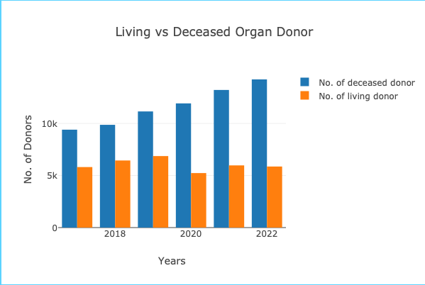
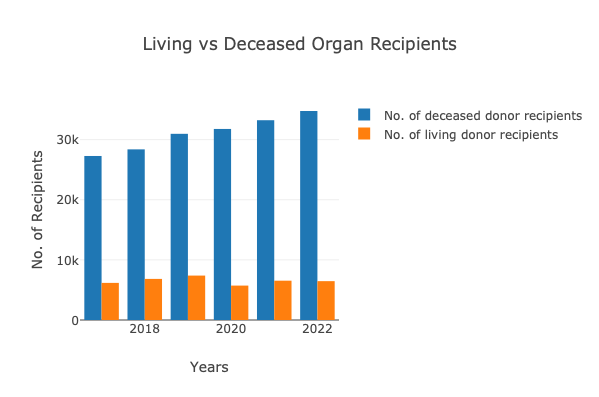
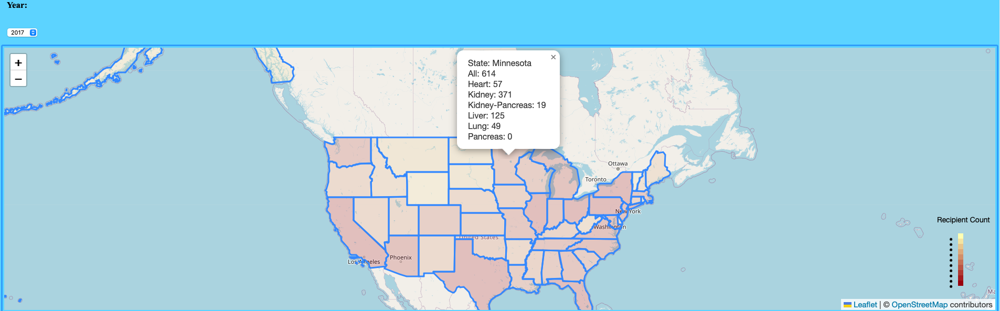
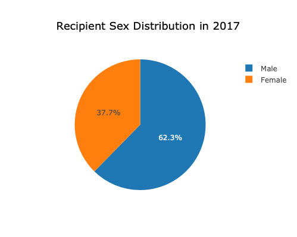
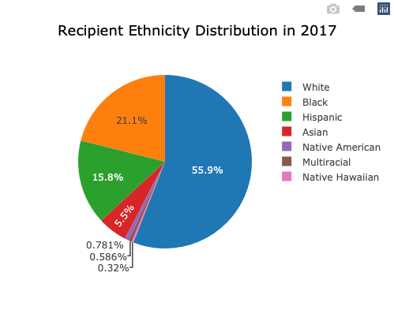
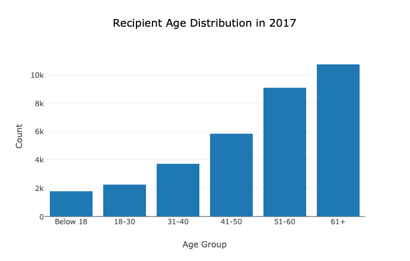

# Project-3-Group 3 

### Project idea: 
We are showcasing organ donation and transplantation across the American States for the following organs: Heart, Kidney, Kidney-Pancreas, Liver, Lung, Pancreas, and All. 

Meta origin dataset was obtained from the Health Resources and Service Administration: https://data.hrsa.gov/data/download. Includes data from January 1, 2017 - and December 31, 2022.
GeoJson was obtained from: https://public.opendatasoft.com/explore/dataset/us-state-boundaries/table/. for the United States US Boundaries for our map visualization.

#### The following datasets will be used for this project: 
1. overview-national.csv: 
 This visualization will include two bar charts: one for living donors/recipients and one for decreased organs/recipients:
- x-axis: years 2017-2022
- y-axis: count
  each bar chart will be grouped with one bar for donors and one bar for recipients per each year 

    
  
2. overview-state.csv: 
We will focus on the Transplant Recipients category. This visualization will show the recipient count across the 50 states suing Chloropleth. Users will be able to select the year from 2017-2022 to show the map for each year. When selecting a state, a popup will show the recipient count for all organs, heart, kidney, kidney-pancreas, liver, lung, and pancreas.   

4. recipient-demographics: 
Demographic data will be displayed for the following:
- Sex: pie chart for each year
- Age: 6 bins displayed in a histogram for each year
- Race: 7 bins displayed in a pie chart for each year

  

5. Limitations:
Limitation #1: Dataset is large and extensive, presenting it as counts and percentages may not reflect and capture the full complexity of the data

Limitation #2: Health Resources & Services Administration (HRSA) suppressed some data to maintain the privacy of individuals: 
HRSA lists all counts less than 16 as “suppressed”. This is to avoid possible back calculation of the category 

Group members: Alexandru Arnautu, Yasmin Bsata, Keyana Pregent, Lovepreet Singh

 

