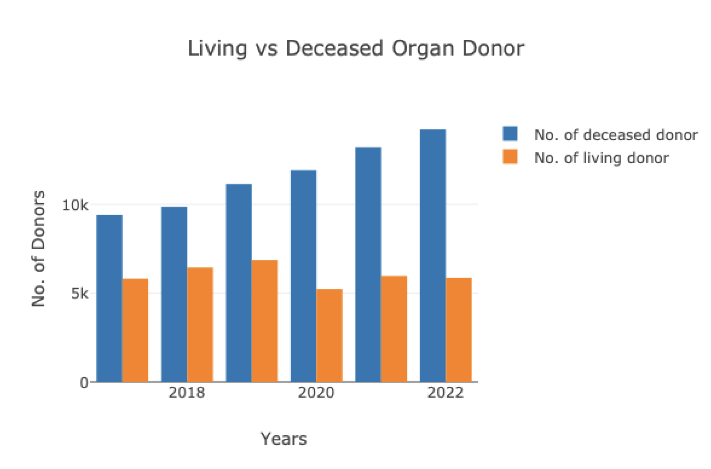
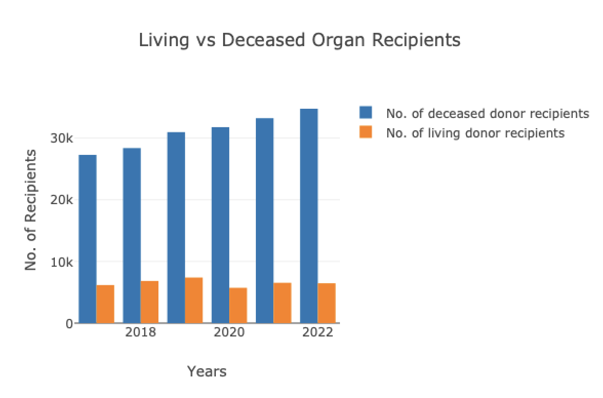
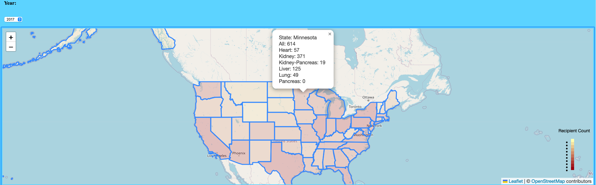
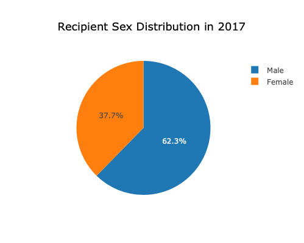
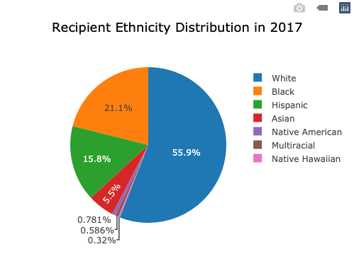

# Organ Donation and Transplantation in US (2017-2022)

We are showcasing organ donation and transplantation across the American States for the following organs: Heart, Kidney, Kidney-Pancreas, Liver, Lung, Pancreas, and All. 

## Acknowledgements

 - [Health Resources and Service Administration Data (2017- 2022)](https://data.hrsa.gov/data/download)
 - [GeoJson for US states](https://public.opendatasoft.com/explore/dataset/us-state-boundaries/table/)


## Run Locally

Clone the project

```bash
  git clone git@github.com:Lovepreet008/Project-3.git
```

Go to the project directory

```bash
  cd Project-3
```

Install dependencies

```bash
  pip Install pandas
```
```bash
  pip Install Flask
```
```bash
  pip Install numpy
```
```bash
  pip install SQLAlchemy

```
```bash
  pip install psycopg2
```

Start the server

```bash
  python demoapp.py
```


 
## API Reference

#### Get main page

```http
  GET /
```


#### Get demographics data

```http
  GET /api/demographics
```

#### Get national data

```http
  GET /api/national
```

#### Get state data

```http
  GET /api/state
```


## Objectives: 
#### 1. National Overview: 
 This visualization will include two bar charts: one for living donors/recipients and one for decreased organs/recipients:
- x-axis: years 2017-2022
- y-axis: count
  each bar chart will be grouped with one bar for donors and one bar for recipients per each year 

   
  
#### 2. State Overview: 
We will focus on the Transplant Recipients category. This visualization will show the recipient count across the 50 states suing Chloropleth. Users will be able to select the year from 2017-2022 to show the map for each year. When selecting a state, a popup will show the recipient count for all organs, heart, kidney, kidney-pancreas, liver, lung, and pancreas.   




#### 3. Recipient Demographics: 
Demographic data displays the following:
- Sex: pie chart for each year
- Age: 6 bins displayed in a histogram for each year
- Race: 7 bins displayed in a pie chart for each year

  


## Limitations:
Limitation #1: Dataset is large and extensive, presenting it as counts and percentages may not reflect and capture the full complexity of the data

Limitation #2: Health Resources & Services Administration (HRSA) suppressed some data to maintain the privacy of individuals: 
HRSA lists all counts less than 16 as “suppressed”. This is to avoid possible back calculation of the category 


Group members: Alexandru Arnautu, Yasmin Bsata, Keyana Pregent, Lovepreet Singh

 

